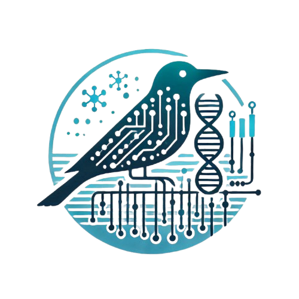

<p align="center">

</p>

# C-BIRD

**CT-PHL Bacterial Identification and Resistance Detection**

[](https://dockstore.org/workflows/github.com/Kincekara/C-BIRD/C-BIRDv2:main?tab=info)
[](https://terra.bio/)
[](https://cromwell.readthedocs.io/en/stable/)
[](https://miniwdl.readthedocs.io/en/latest/)

## Overview

C-BIRD is a small and accurate pipeline for rapid bacterial identification and antimicrobial resistance gene detection for common pathogenic bacteria.
It works with Illumina paired-end reads using *de novo* assembly approach.
C-BIRD can run on [Terra.Bio](https://terra.bio/) platform as well as any Linux machine that has a WDL workflow engine such as [miniwdl](https://github.com/chanzuckerberg/miniwdl).
Producing clinically meaningful results and generating individual reports for each sample is within this project's scope.
So, auto-update of any tool or database is deliberately avoided for strict control and validation purposes.

C-BIRD now uses machine learning models (CheckM2) to asses completeness and contamination of the assembly.
A new custom sketch was created to identfy bacteria for selected genera via Mash.
It includes all the species of `Acinetobacter, Burkholderia, Citrobacter, Enterobacter, Escherichia, Klebsiella, Kluyvera, Metapseudomonas, Morganella, Neisseria, Proteus, Providencia, Pseudomonas, Raoultella, Salmonella, Serratia, Streptococcus`.
Kraken2 and Braken will still be used for taxonomic profiling of reads and the organism that are out of the scope.
Detection of AMR genes depends on NCBI's AMRFinderPlus program and its database.

#### Example Outputs

- [Basic report](https://htmlpreview.github.io/?https://github.com/Kincekara/C-BIRD/blob/main/assets/AR_0055_basic_report.html)
- [Extended report](https://htmlpreview.github.io/?https://github.com/Kincekara/C-BIRD/blob/main/assets/AR_0055_extended_report.html)
- [QC report](https://htmlpreview.github.io/?https://github.com/Kincekara/C-BIRD/blob/main/assets/AR_0055_QC_summary.html)
- [Plain report](./assets/AR_0055_report.docx)

The current programs and tools are used in the C-BIRD pipeline.

| Tools                                                                                             | Version     | Comments                                               |
| ------------------------------------------------------------------------------------------------- | ----------- | ------------------------------------------------------ |
| [FastP](https://github.com/OpenGene/fastp)                                                           | 1.0.1      | QC, adapter removal, quality filtering and trimming    |
| [BBTools](https://jgi.doe.gov/data-and-tools/software-tools/bbtools/)                                | 39.49       | phiX removal & normalization (non-random downsampling) |
| [Kraken2](https://github.com/DerrickWood/kraken2) / [Bracken](https://github.com/jenniferlu717/Bracken) | 2.1.3 / 2.9 | Taxonomic profiling and abundance estimation of reads  |
| [SPAdes](https://github.com/ablab/spades)                                                            | 4.2.0       | *De novo* assembly                                   |
| [Mash](https://github.com/marbl/Mash)                                                                | 2.3         | Bacterial identification                               |
| [QUAST](https://github.com/ablab/quast)                                                              | 5.3.0       | Genome assembly evaluation                             |
| [CheckM2](https://github.com/chklovski/CheckM2)                                                      | 1.1.0       | Completeness and contamination                         |
| [mlst](https://github.com/tseemann/mlst)                                                             | 2.25.0      | MLST typing                                            |
| [AMRFinderPlus](https://github.com/ncbi/amr)                                                         | 4.2.5       | AMR gene identification                                |
| [BLAST+](https://blast.ncbi.nlm.nih.gov/doc/blast-help/downloadblastdata.html)                       | 2.17.0      | Target gene search                                     |
| [PlasmidFinder](https://bitbucket.org/genomicepidemiology/plasmidfinder/src/master/)                 | 3.0.1       | Plasmid detection                                      |
| [Cbird-Util](./assets/cbird-util/)                                                                   | 2.1         | Scripts for summary report generation                  |

## Quick Start

C-BIRD is available in [Dockstore](https://dockstore.org/workflows/github.com/Kincekara/C-BIRD/C-BIRDv2:main?tab=info) for Terra. The following inputs are required to run the C-BIRD pipeline.

| Input          | Description                                                                                               |
| -------------- | --------------------------------------------------------------------------------------------------------- |
| `read1`      | first FASTQ file (paired-end)                                                                             |
| `read2`      | second FASTQ file (paired-end)                                                                            |
| `samplename` | Name of the sample being processed                                                                        |
| `kraken2_db` | Kraken2/Bracken database ([Download](https://benlangmead.github.io/aws-indexes/k2) )                         |
| `checkm2_db` | CheckM2 database V3 ([Download](https://zenodo.org/records/14897628/files/checkm2_database.tar.gz?download=1) ) |

Please check wiki for optional inputs, additional details and reports.

## Installation

You can obtain C-BIRD via `git` but it is advised to download a release version to avoid any developmental changes.

```bash
# Download a C-BIRD release
wget https://github.com/Kincekara/C-BIRD/archive/refs/tags/2.3.0.tar.gz
tar -xvf 2.3.0.tar.gz

# Download required databases
wget https://genome-idx.s3.amazonaws.com/kraken/k2_standard_08gb_20250402.tar.gz
wget https://zenodo.org/records/14897628/files/checkm2_database.tar.gz
```

## Running C-BIRD

You need to install miniwdl to run C-BIRD in your linux pc. Miniwdl can be obtained:

- via PyPI: `pip3 install miniwdl` or
- via conda: `conda install -c conda-forge miniwdl`

Plese see the [miniwdl repo](https://github.com/chanzuckerberg/miniwdl/) for further instructions.

```bash
# single sample
miniwdl run ~/C-BIRD-2.3.0/workflows/wf_c-bird.wdl samplename="samplename" read1="read1.fastq.gz" read2="read2.fastq.gz" kraken2_db="k2_standard_20240904.tar.gz" checkm2_db="checkm2_database.tar.gz"
```

## multiBIRD

A wrapper workflow is available to make easier to run multiple samples on local machines. multiBIRD allows users to give an input list as a tab-separeted file like below.

**samples.tsv**

```
samplename1 /path/to/sample1_read1.fastq.gz /path/to/sample1_read2.fastq.gz
samplename2 /path/to/sample2_read1.fastq.gz /path/to/sample2_read2.fastq.gz
samplename3 /path/to/sample3_read1.fastq.gz /path/to/sample3_read2.fastq.gz
...
```

**inputs.json**

```
{
  "multibird.inputSamplesFile": "/path/to/samples.tsv",
  "multibird.kraken2_db": "/path/to/k2_standard_20240904.tar.gz",
  "multibird.checkm2_db": "/path/to/checkm2_database.tar.gz"
}
```

After preparing samples.tsv and inputs.json file, you can run multiple samples at once.

```bash
# multiple samples
miniwdl run ~/C-BIRD-2.3.0/workflows/wf_multibird.wdl -i inputs.json
```

## Disclaimer

The results generated by this pipeline should not be used as the sole basis for any clinical decision-making.
Users are responsible for ensuring that the pipeline is used in compliance with all applicable laws, regulations, and guidelines.
The authors and contributors of this pipeline do not assume any liability for any direct, indirect, incidental, or consequential damages arising from the use of the pipeline or the information generated by it.
Additionally, please note that genotypic results obtained from this pipeline may not always correlate with phenotypic resistance profiles.
It is essential to confirm any findings with appropriate phenotypic testing and clinical correlation.

## Additional Notes

C-BIRD includes code traces of [Theiagen&#39;s Public Health Bacterial Genomics](https://github.com/theiagen/public_health_bacterial_genomics) workflows.
If you need a universal and more sophisticated pipeline, please check Theiagen's TheiaProk workflow.
